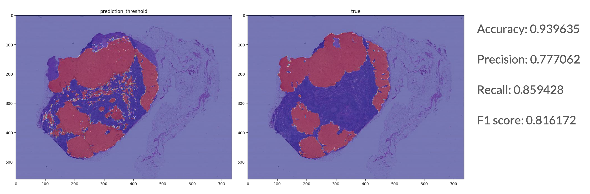

# Cancer Detection in Gigapixel Pathology images

This is my final project for COMSW4995 Applied Deep Learning. This project is inspired by [this](https://arxiv.org/abs/1703.02442) paper.

## Introduction

As the Detecting Cancer Metastases paper states in its introduction,each year, the treatment decisions for more than 230k breast cancer patients in the U.S. hinge on whether the cancer has metastasized away from the breast. 

Therefore, it is very important for pathologist to be able determine whether cancer has spread beyond a primary tumor into the lymphatic system. If the sentinel nodes are free of cancer, then cancer is unlikely to have spread, and removing additional lymph nodes is unnecessary.

The goal of this project is to use a deep learning model to act as an assistance tool for the pathologists to automatically detect and localize tumors as small as 100 x 100 pixels in gigapixel microscopy images. Note that the scope of the model is limited to being a second opinion since a misdiagnosis could be lethal to the patient.

## Code

Please take a look at the notebook `Cancer_Detection.ipynb`. For the sake of space we have uploaded the preprocessed data which we use to train and create the cancer heatmap mask. The original data comes from the [CAMELYON16](https://camelyon16.grand-challenge.org/Data/) challenge.

## Results

We present two models in our code, a pretrained model based on InceptionV3 and our own custom CNN.
Our train was produced from four slides
Our test swas produced from two slides

### InceptionV3 Results

| Train Accuracy | Validation Accuracy | Test Accuracy |
|----------------|---------------------|---------------|
| 0.9265         | 0.9001              | 0.9001        |

Heatmap Predicted using InceptionV3:

### Custom CNN Results

| Train Accuracy | Validation Accuracy | Test Accuracy |
|----------------|---------------------|---------------|
| 0.8757         | 0.9189              | 0.7992        |

Heatmap Predicted using Custom CNN:

## Slides and Youtube Presentation

You can see a more detailed explanation of the project [here](https://youtu.be/GfDlLbh6oCQ).

References are at the last slide of the presentation pdf.

